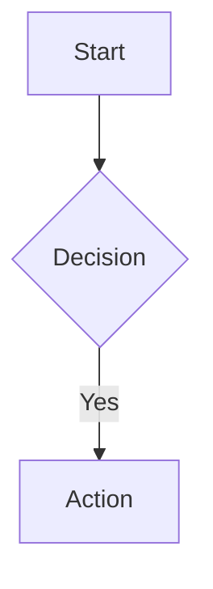

# Obsidian Flavored Markdown 技能

创建和编辑符合 Obsidian 规范的 Markdown。Obsidian 融合了 CommonMark、GitHub Flavored Markdown、LaTeX 数学语法，以及自身特有的扩展语法（wikilinks、callouts、embeds、block references 等）。

本技能涵盖**所有**内置 Markdown 语法以及 Obsidian 的全部扩展语法。编写 Obsidian 笔记时，请遵循以下规范，以确保在编辑/实时预览模式和阅读模式下均能正确渲染。

---

## 示例文件

详细示例位于 `examples/` 目录中。**请勿预先加载所有示例文件**——仅在需要该语法类别时才读取对应文件。下方的快速参考涵盖大多数常见用法；示例文件用于查阅边缘情况和详细模式。

| 分类 | 文件 |
|---|---|
| 基础格式 | [text-and-headings.md](examples/text-and-headings.md) |
| 链接与嵌入 | [links-and-embeds.md](examples/links-and-embeds.md) |
| Callouts | [callouts.md](examples/callouts.md) |
| 表格与列表 | [tables-and-lists.md](examples/tables-and-lists.md) |
| 代码与数学 | [code-and-math.md](examples/code-and-math.md) |
| 图表 | [mermaid-diagrams.md](examples/mermaid-diagrams.md) |
| 属性与标签 | [properties-and-tags.md](examples/properties-and-tags.md) |
| 进阶内容 | [footnotes-comments-html.md](examples/footnotes-comments-html.md) |

---

## 快速参考

详细用法示例请参阅上表 `examples/` 目录。本节提供常见操作的快速语法参考。

### 基础格式

```markdown
# Heading 1  ## Heading 2  ### Heading 3
**bold**  *italic*  ***bold+italic***  ~~strikethrough~~  ==highlight==  `inline code`
```

高亮（`==text==`）是 Obsidian 特有的语法。使用 `\` 转义特殊字符：`\*`、`\_`、`\#`

### 链接（Wikilinks - Obsidian 默认方式）

```markdown
[[Note]]                        # 基础链接
[[Note|Display]]                # 自定义显示文本
[[Note#Heading]]                # 链接到标题
[[Note#^block-id]]              # 链接到块
[[##heading]]                   # 在整个保险库中搜索标题
```

**块引用：** 在任意块的末尾添加 `^id`：
```markdown
此段落可被引用。 ^my-block-id
```

**Markdown 链接**（空格用 `%20`）：`[Text](Note%20Name.md#Heading)`

### 嵌入（Embeds）

所有嵌入均使用 `!` 前缀：`![[target]]`

```markdown
![[Note]]                       # 嵌入整篇笔记
![[Note#Section]]               # 嵌入标题段落
![[image.png|640]]              # 带宽度的图片（保持宽高比）
![[audio.mp3]]                  # 音频：.flac, .m4a, .mp3, .ogg, .wav, .webm
![[video.mp4]]                  # 视频：.mp4, .webm, .ogv
![[doc.pdf#page=3]]             # PDF 第 3 页
```

外部图片：``（管道尺寸语法为 Obsidian 特有）

### Callouts

```markdown
> [!note] 默认样式
> [!tip]+ 默认展开（点击折叠）
> [!warning]- 默认折叠（点击展开）
> > [!example] 嵌套 callout（使用额外的 >）
```

**12 种内置类型：** `note`、`abstract`/`summary`/`tldr`、`info`/`todo`、`tip`/`hint`/`important`、`success`/`check`/`done`、`question`/`help`/`faq`、`warning`/`caution`/`attention`、`failure`/`fail`/`missing`、`danger`/`error`、`bug`、`example`、`quote`/`cite`

**自定义 callouts**（在 `.obsidian/snippets/` 中的 CSS 片段）：
```css
.callout[data-callout="custom-type"] {
    --callout-color: 255, 100, 50;
    --callout-icon: lucide-sparkles;
}
```

**GitHub 兼容性：** 仅 5 种类型在 GitHub 上有效：`NOTE`、`TIP`、`IMPORTANT`、`WARNING`、`CAUTION`。折叠、嵌套和其他 7 种类型为 Obsidian 特有。

### 列表与表格

```markdown
- 无序列表  * 也可使用  + 也可使用
1. 有序列表
   1. 嵌套（3 空格缩进）
- [ ] 未完成任务  - [x] 已完成任务

| 左对齐 | 居中 | 右对齐 |
|:-----|:------:|------:|
| 数据 | 数据   | 数据  |
```

### 代码与数学

````markdown
`行内代码`  ``含 ` 反引号`的代码``

```language
代码块
```

行内数学：$x^2$, $\frac{a}{b}$, $\sqrt{x}$
块级数学：
$$
\int_a^b f(x)dx
$$
````

### 图表（Mermaid）

````markdown

````

支持的图表类型：flowchart、sequence、gantt、pie、class、state、erDiagram。节点可使用 `internal-link` class 实现可点击链接。

### 属性（Frontmatter）

```yaml
---
title: My Note
tags: [project, active]
aliases: [Alternative Name]
related: "[[Other Note]]"  # 必须加引号！
---
```

**属性类型：** 文本、数字、复选框、日期、日期与时间、列表、链接

**重要规则：**
- 属性名在整个保险库中必须保持**类型一致**
- 内部链接**必须加引号**：`link: "[[Note]]"`
- 使用复数形式：`tags`、`aliases`、`cssclasses`（单数形式已弃用）

### 标签

```markdown
#tag  #nested/tag  #tag-with-dashes
```

- 必须包含至少一个非数字字符（`#1984` 无效，`#y1984` 有效）
- 不区分大小写，不允许空格
- 允许的字符：字母、数字、`_`、`-`、`/`
- 不允许：``.`、`&`、`@`、`$`、`%`、括号

### 脚注与注释

```markdown
带脚注的文本[^1]。
[^1]: 脚注内容。

行内脚注^[此处为内容。]  # 仅在阅读视图有效

%%Obsidian 注释%%  # 在阅读视图中隐藏
<!-- HTML 注释 -->  # 可移植
```

### HTML

Obsidian 支持行内 HTML：`<div>`、`<span style="color: red;">`、`<details>`、`<kbd>Ctrl</kbd>`、`<br>`、`<mark>`

---

## 重要行为说明

### Wikilinks 与 Markdown 链接

Wikilinks `[[Note]]` 是 Obsidian 的默认方式——重命名时自动更新，且支持块引用。Markdown 链接 `[Text](file.md)` 具有更好的可移植性，但不会自动更新。前往 设置 > 文件与链接 进行配置。

### 块引用与嵌入

块可以被**引用**（仅链接）或**嵌入**（内容实时包含）。块 ID 可以放在段落、列表、表格或引用块之后。嵌入一个标题段落时会包含该标题下直到下一个同级标题之间的所有内容。

### Callout 的折叠与嵌套

在类型后加 `+` 表示默认展开，加 `-` 表示默认折叠。Callout 可以通过增加 `>` 标记任意深度地嵌套。

### 属性约束

属性名在整个保险库中必须保持**类型一致**。属性中的内部链接**必须加引号**以避免 YAML 解析错误。使用复数形式（`tags`、`aliases`、`cssclasses`），单数形式已弃用。

### 可移植性注意事项

**仅 Obsidian 有效**（在 Obsidian 外无法渲染）：wikilinks、embeds、块引用、`==高亮==`、`%%注释%%`、图片管道尺寸语法、7 种额外 callout 类型、callout 折叠与嵌套

**GitHub 兼容：** 标准 Markdown、MathJax、Mermaid、脚注、5 种 callout 类型（NOTE、TIP、IMPORTANT、WARNING、CAUTION）、表格、任务列表、删除线

---

## 无效字符

文件名和链接目标中不能使用以下字符：`# | ^ : %% [[ ]]`
