# Mermaid Diagram Examples

Mermaid diagrams are rendered natively in Obsidian -- no plugins needed.

---

## Flowchart (Top-Down)

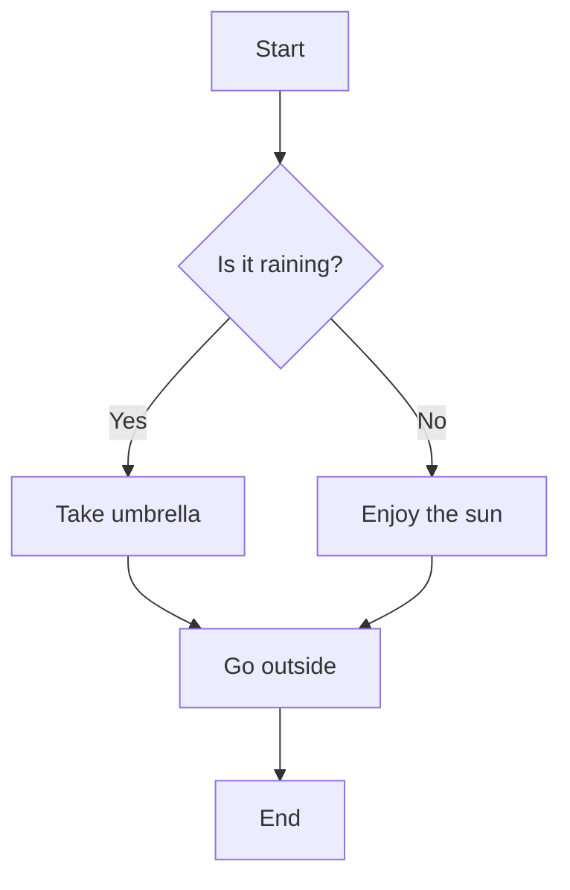

## Flowchart (Left-Right)

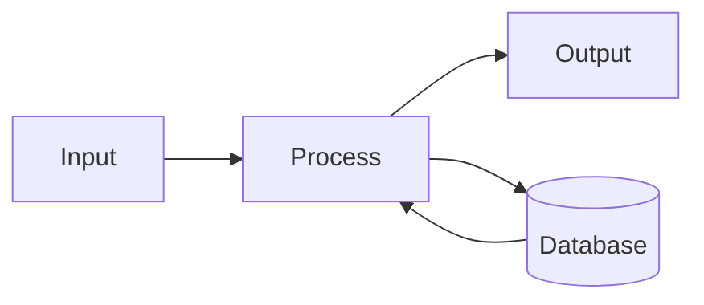

## Flowchart with Subgraphs

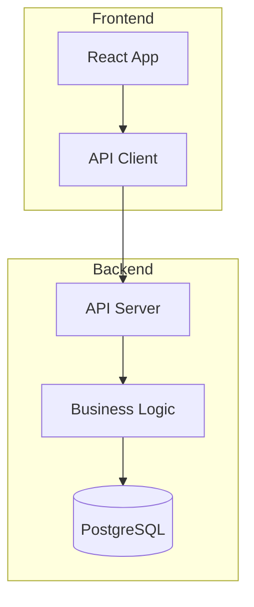

---

## Sequence Diagram

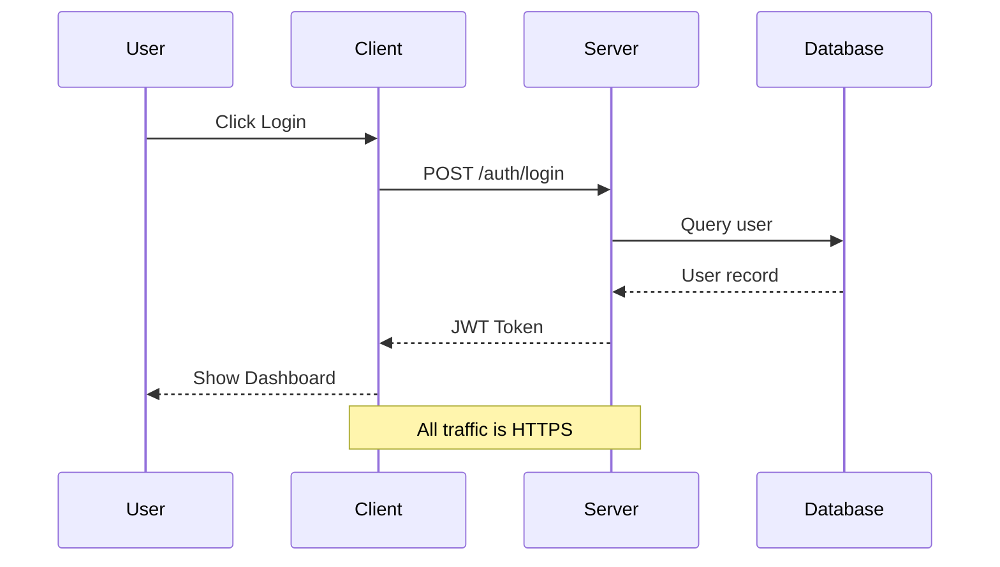

---

## Gantt Chart

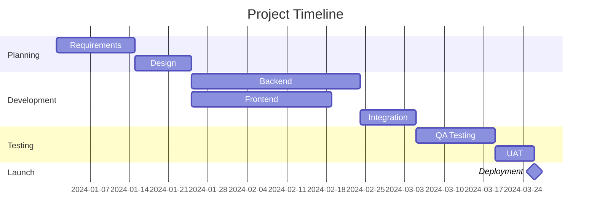

---

## Pie Chart

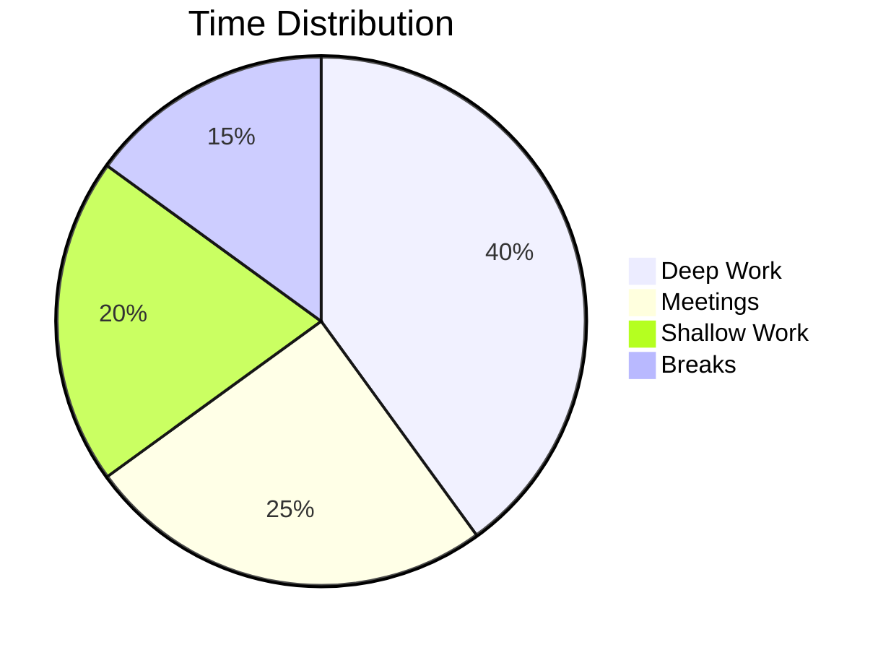

---

## Class Diagram

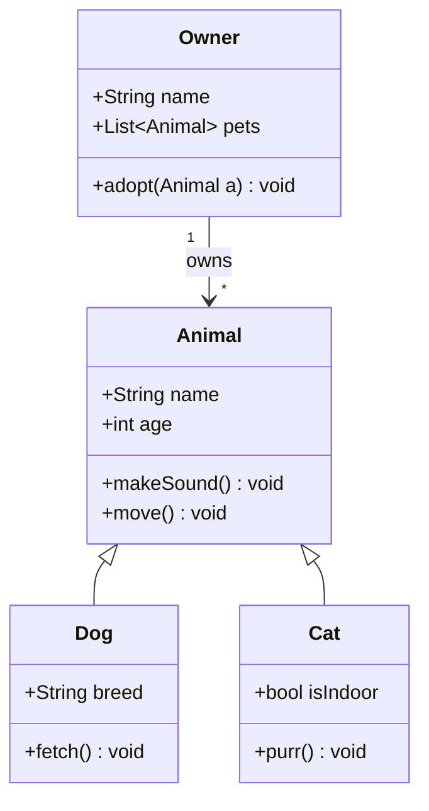

---

## State Diagram

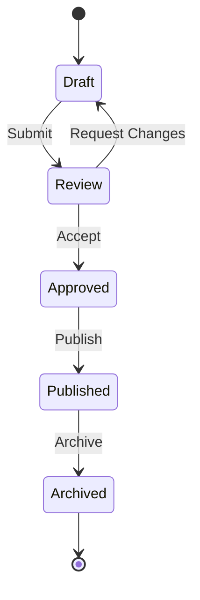

---

## Entity Relationship Diagram

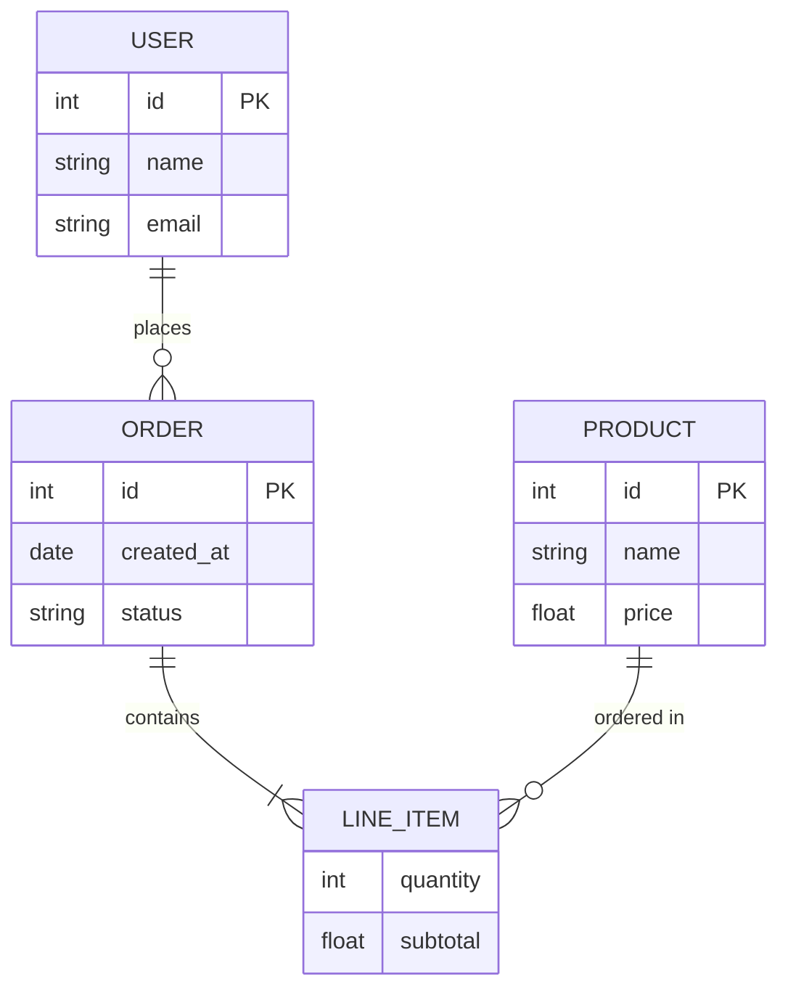

---

## Linking Nodes to Notes

Nodes with the `internal-link` class become clickable links to Obsidian notes (do NOT appear in Graph view):

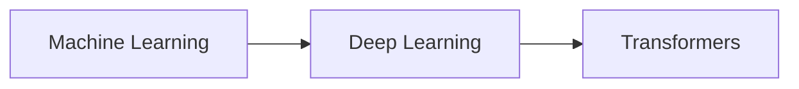

---

## Requirement Diagram

```mermaid
requirementDiagram
    requirement TestReq {
        id: 1
        text: "System shall do X"
    }
    functionalRequirement TestReq2 {
        id: 1.1
        text: "System shall do Y"
    }
    TestReq -ren-> TestReq2
```

---

## Git Graph

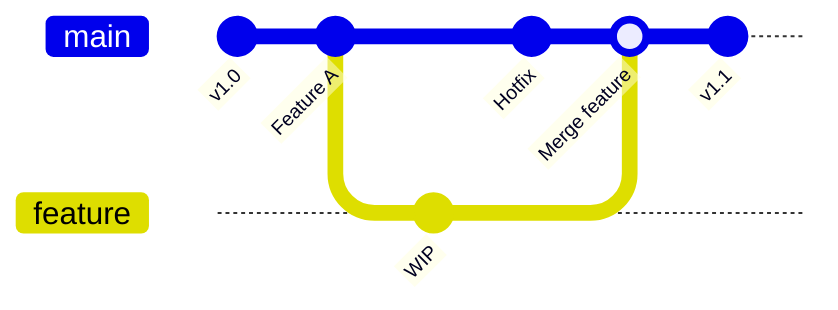

---

## Journey Diagram

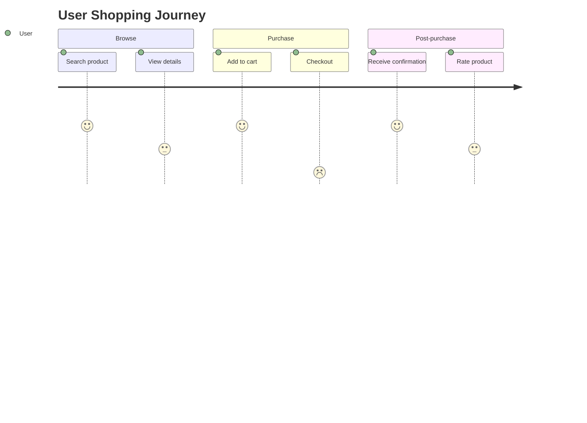

---

## C4 Context Diagram

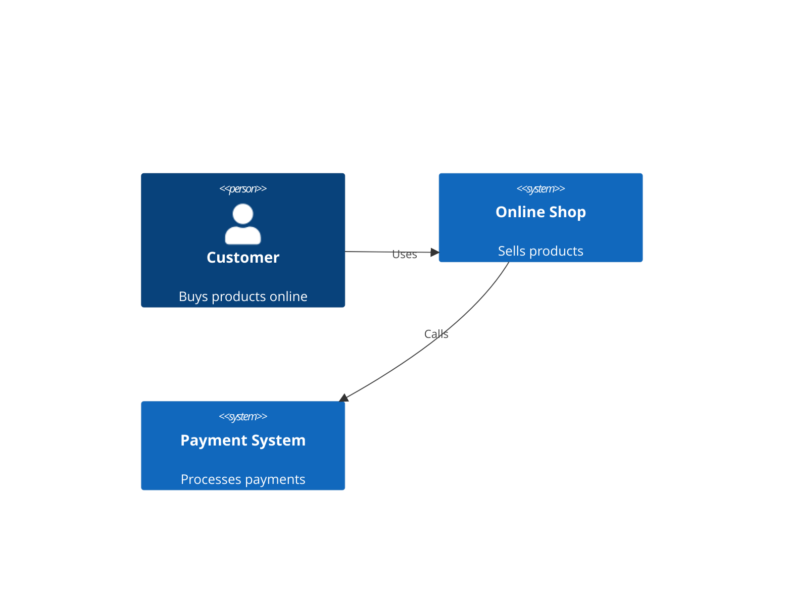

> [!note] Tip
> C4 diagrams require the `c4d3` or similar Mermaid plugin in some renderers. They work natively in Obsidian with the built-in Mermaid renderer.

---

## 来源

- [Obsidian Advanced formatting syntax](https://obsidian.md/help/advanced-syntax) — Mermaid diagrams, internal links from diagrams
- [Mermaid.js Documentation](https://mermaid.js.org/) — All supported diagram types and syntax
