# Mermaid Diagram Examples

Mermaid diagrams are rendered natively in Obsidian -- no plugins needed.

---

## Flowchart (Top-Down)

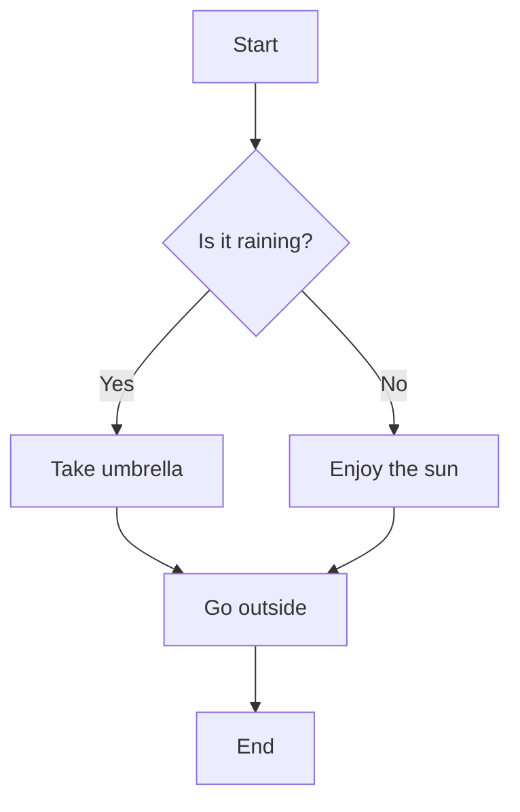

## Flowchart (Left-Right)

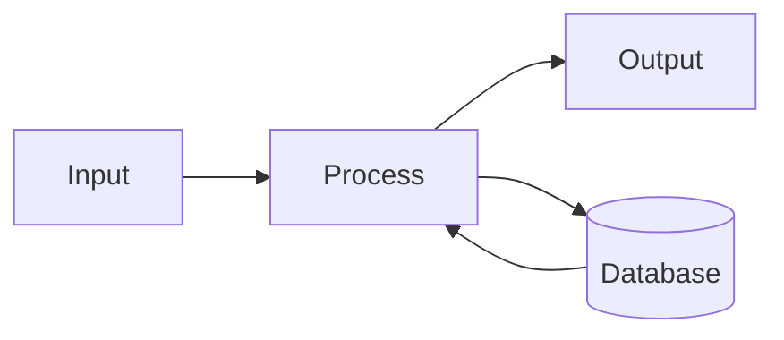

## Flowchart with Subgraphs

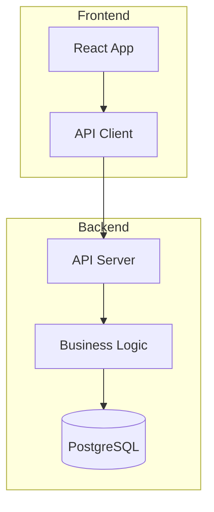

---

## Sequence Diagram

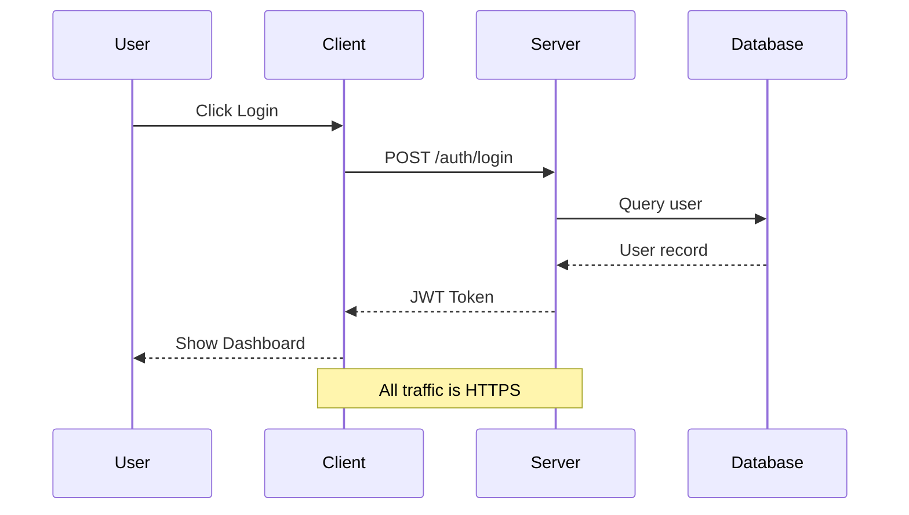

---

## Gantt Chart

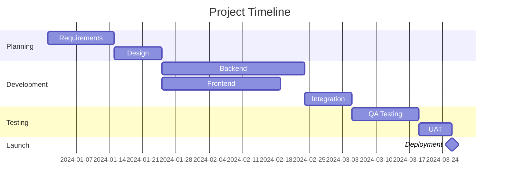

---

## Pie Chart

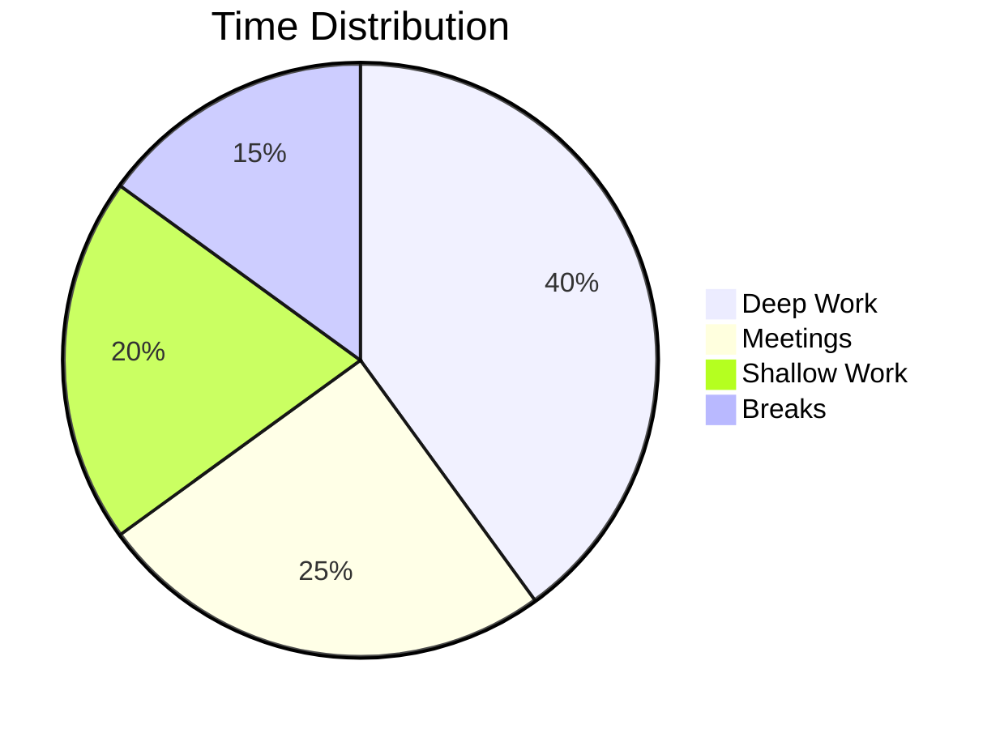

---

## Class Diagram

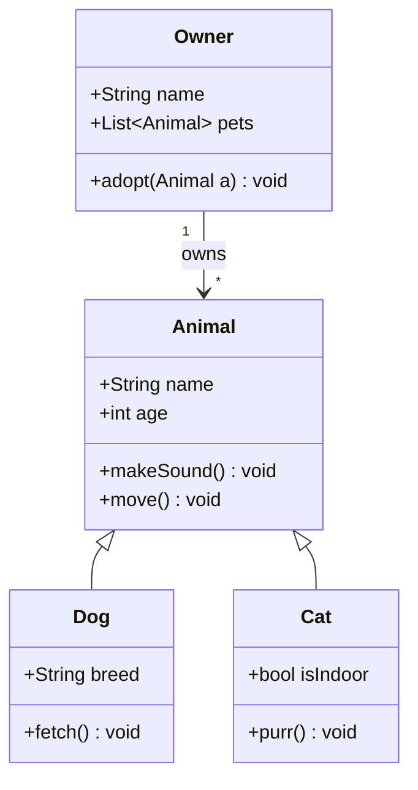

---

## State Diagram

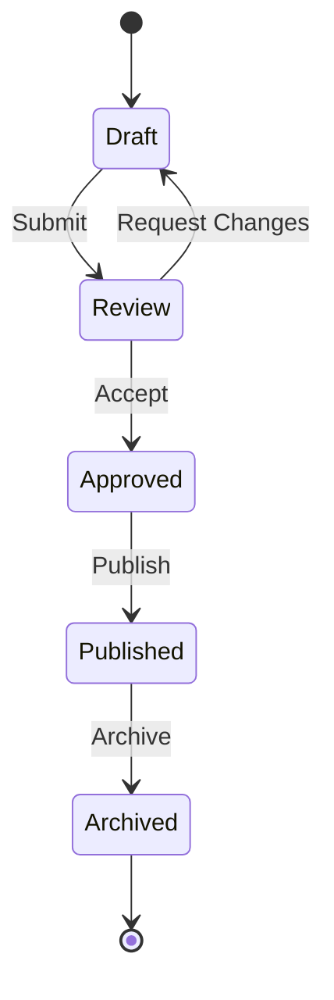

---

## Entity Relationship Diagram

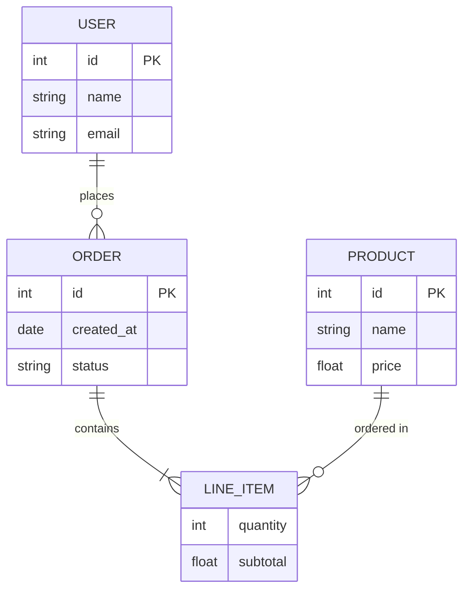

---

## Linking Nodes to Notes

Nodes with the `internal-link` class become clickable links to Obsidian notes (do NOT appear in Graph view):

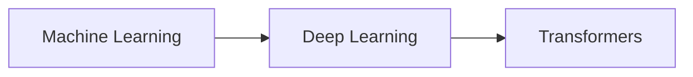

---

## Requirement Diagram

```mermaid
requirementDiagram
    requirement TestReq {
        id: 1
        text: "System shall do X"
    }
    functionalRequirement TestReq2 {
        id: 1.1
        text: "System shall do Y"
    }
    TestReq -ren-> TestReq2
```

---

## Git Graph

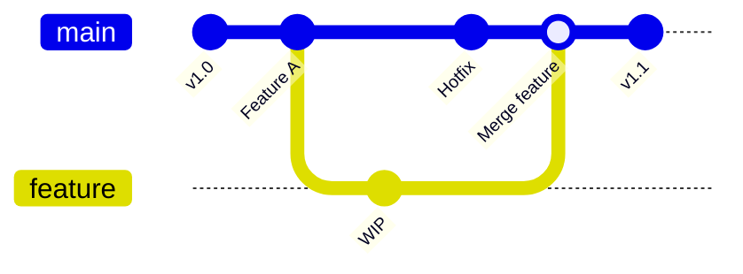

---

## Journey Diagram

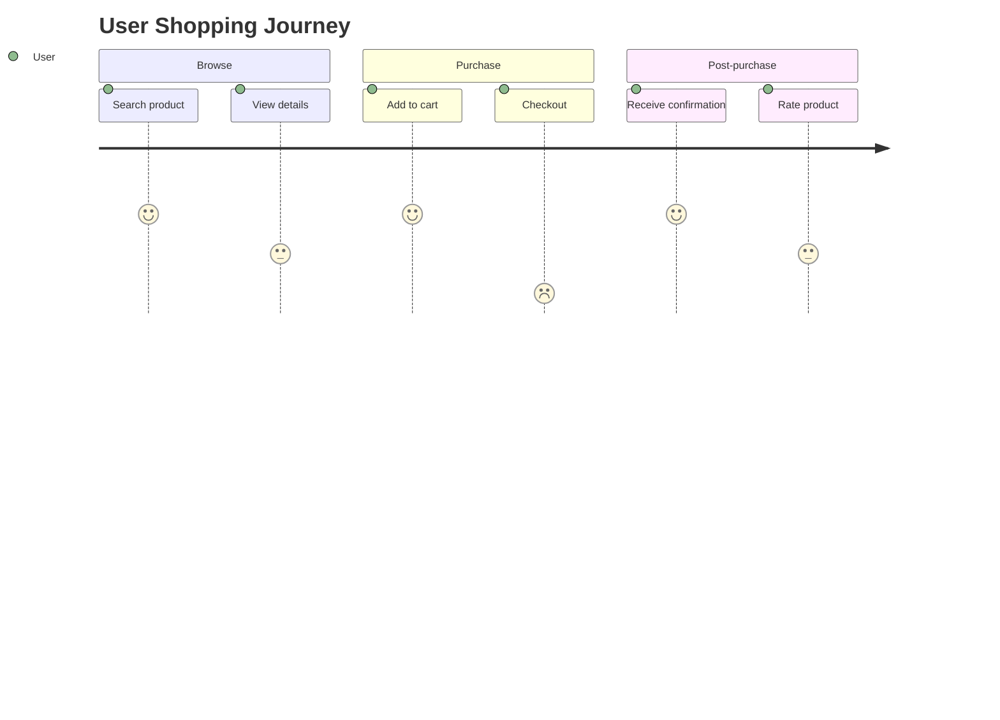

---

## C4 Context Diagram

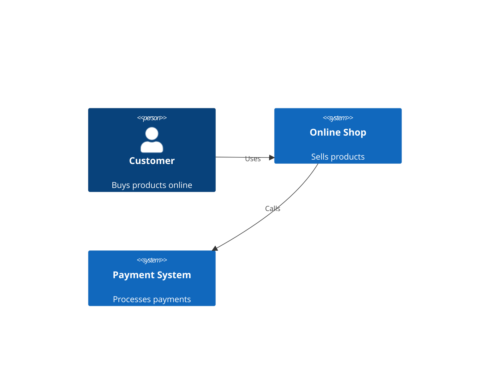

> [!note] Tip
> C4 diagrams require the `c4d3` or similar Mermaid plugin in some renderers. They work natively in Obsidian with the built-in Mermaid renderer.

---

## 常见陷阱（Common Pitfalls）

以下是需要特别注意的语法问题，这些错误在 Obsidian 中会导致 Mermaid 图表无法渲染。

### 1. 避免在节点标签中使用 `]`

Mermaid 使用 `]` 来关闭节点定义。在节点标签文本中出现的 `]` 会导致节点被提前终止：

```mermaid
%% ❌ 错误 — 标签中的 ] 会提前关闭节点
A{"答案有价值？<br/><sub>是否有价值？</sub>"]
B["处理完成"]

%% ✅ 正确 — 菱形节点用 } 关闭
A{"答案有价值？<br/><sub>是否有价值？</sub>"}
B["处理完成"]
```

**常见错误场景**：在 decision diamond 节点 `{...}` 中使用 `</sub>` 等 HTML 标签时，闭合的 `</sub>` 包含 `/sub` 后的 `>`，但如果写成了 `]</sub>` 形式，`]` 会破坏语法。

### 2. 菱形决策节点必须使用 `{...}` 而非 `[...]`

```mermaid
%% ❌ 错误
A[这是一个判断？]

%% ✅ 正确 — 菱形用 {}
A{这是一个判断？}
```

### 3. `flowchart` vs `graph` — 优先使用 `flowchart`

```mermaid
%% 推荐 — 支持更丰富的样式和更好的渲染
flowchart TD
    A[Start] --> B{Decision}
    B -->|"Yes"| C[Action]

%% 旧语法，仍可用但不推荐
graph TD
    A[Start] --> B{Decision}
```

### 4. 子图（Subgraph）语法

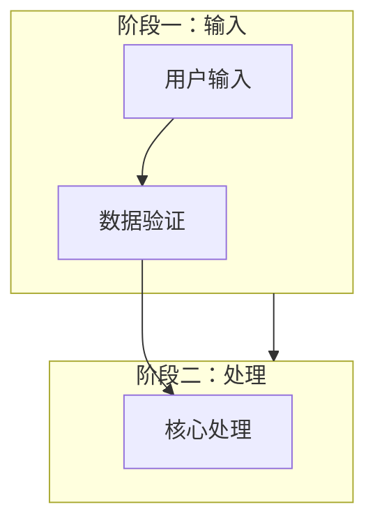

> 子图的 `["标题"]` 需要加引号才能包含中文。

### 5. 样式应用（Style）

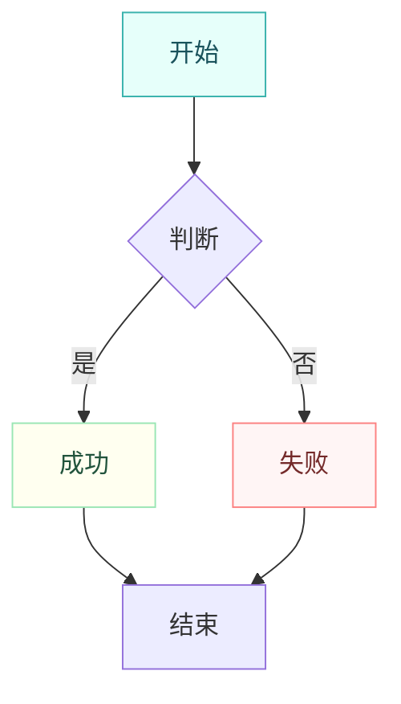

---

## 来源

- [Obsidian Advanced formatting syntax](https://obsidian.md/help/advanced-syntax) — Mermaid diagrams, internal links from diagrams
- [Mermaid.js Documentation](https://mermaid.js.org/) — All supported diagram types and syntax
