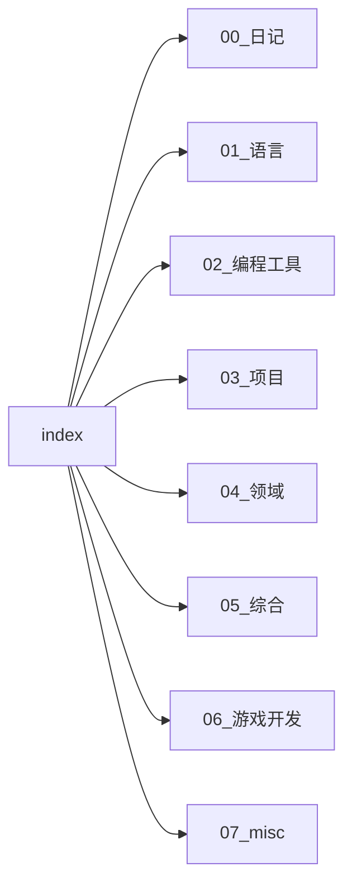

# Relationships Summary — 引用网络总览

> 追踪 wiki 页面之间的 wikilink 引用关系
> 按需加载：只有执行 ingest/query/lint 时才读取对应页面文件

## 引用统计概览

| 指标 | 值 |
|------|-----|
| 总 wiki 页面数 | 0 |
| 总引用数 | 0 |
| 平均引用数 | 0 |

## 高引用页面（入站引用 > 3）

| 页面 | 入站引用数 | 说明 |
|------|-----------|------|

*暂无记录*

## 孤立页面（无入站引用）

| 页面 | 所属目录 | 说明 |
|------|----------|------|

*暂无记录*

## 引用分布

## 最近更新

| 时间 | 变化 |
|------|------|

---

## 引用关系说明

| 关系类型 | 含义 |
|----------|------|
| 出站引用 | 此页面通过 `[[wikilink]]` 引用了其他页面 |
| 入站引用 | 其他页面通过 `[[wikilink]]` 引用了此页面 |

---

> [!note]+ 如何更新引用关系
> 1. 在 ingest 时自动分析新页面的 wikilinks
> 2. 在 lint 时检查孤立页面
> 3. 在 wiki-lint-agent 中调用关系更新
