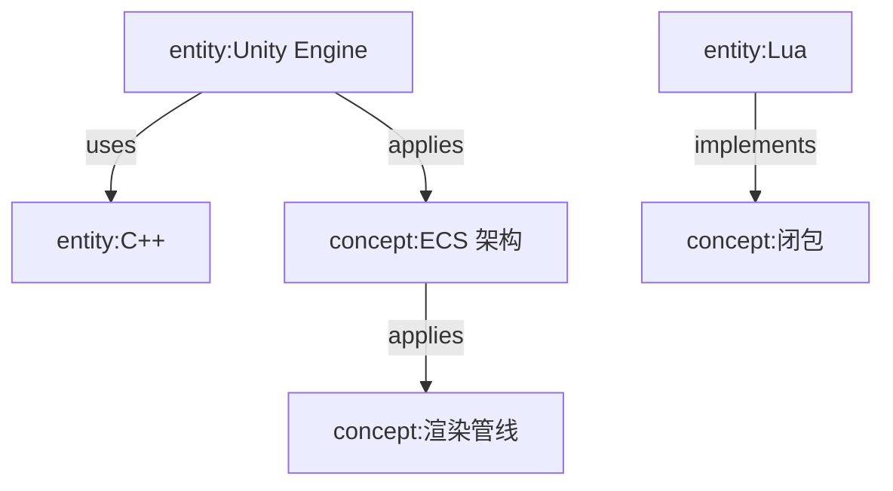

# Plan A: LLM Wiki 三层架构升级方案

> 侧重：简单清晰，实体概念以独立页面存在

---

## 一、目标结构（完整目录图）

```
wiki/
├── index.md                    # 总索引（更新：添加 entities 层入口）
├── log.md                      # 时间日志（保持不变）
│
├── _index/                     # 索引层（保持不变）
│   ├── index.md                # 主索引入口
│   ├── index_by_category.md    # 功能分类索引
│   ├── index_by_time.md        # 时间归档索引
│   ├── index_00_日记.md        # 各分类详情（含 entities 入口）
│   ├── index_01_语言.md
│   ├── index_02_编程工具.md
│   ├── index_03_项目.md
│   ├── index_04_领域.md
│   ├── index_05_综合.md
│   ├── index_06_游戏开发.md
│   └── base/                   # Obsidian Bases 数据库视图
│       ├── index_00_日记_notes.base
│       ├── index_01_语言_notes.base
│       └── ... (保持不变)
│
├── notes/                      # 详细笔记层（从 00_xxx 重命名）
│   ├── 00_日记/                # 日常随手记
│   ├── 01_语言/                # 编程语言笔记
│   │   ├── 脚本语言/           # 子分类
│   │   └── 配置语言/           # 子分类
│   ├── 02_编程工具/            # IDE/构建/版本控制
│   ├── 03_项目/                # 个人/协作项目
│   ├── 04_领域/                # AI/图形学/网络/物理
│   ├── 05_综合/                # 跨领域分析/综述
│   ├── 06_游戏开发/            # 游戏引擎/渲染
│   └── 07_misc/                # 杂项
│
└── entities/                   # 实体概念层（新增）
    ├── _index.md               # entities 总索引
    ├── entities/               # 实体页（具体事物）
    │   ├── tools/              # 工具：VS Code, CMake, Git...
    │   ├── languages/           # 编程语言：Lua, C++, Shaders...
    │   ├── projects/           # 项目：AINote引擎, 工具名...
    │   └── _template.md        # 实体模板
    │
    ├── concepts/               # 概念页（抽象概念）
    │   ├── design-patterns/    # 设计模式
    │   ├── architecture/      # 架构思想
    │   ├── rendering/         # 渲染相关概念
    │   └── _template.md       # 概念模板
    │
    ├── summaries/             # Summary 页（领域综述）
    │   ├── lua-summary.md     # Lua 语言综述
    │   ├── cpp-summary.md     # C++ 语言综述
    │   ├── game-engine-summary.md  # 游戏引擎综述
    │   └── _template.md       # Summary 模板
    │
    └── relationships/         # 关系图谱
        ├── graph.md           # 关系总览图（Mermaid）
        └── pages/             # 逐页关系记录
```

---

## 二、Frontmatter Schema 扩展

### 2.1 实体页 (entities/entities/*.md)

```yaml
---
title: 实体名称
type: entity                   # 固定值：entity
subtype: tool|language|project|...  # 实体子类型
created: YYYY-MM-DD
updated: YYYY-MM-DD
description: 一句话描述（30字以内）
aliases: [别名1, 别名2]        # 可选：搜索别名

# 关系字段（供 Agent 和搜索使用）
relationships:
  implements: [["concept:设计模式", "相关概念"]]
  uses: [["entity:Lua", "使用的工具/语言"]]
  related: [["entity:其他实体"]]

tags: [entity, tool, ...]     # 标签
---
```

### 2.2 概念页 (entities/concepts/*.md)

```yaml
---
title: 概念名称
type: concept                  # 固定值：concept
domain: rendering|architecture|design-pattern|...  # 所属领域
created: YYYY-MM-DD
updated: YYYY-MM-DD
description: 一句话描述（30字以内）
aliases: [别名1, 别名2]

# 关系字段
relationships:
  applied-by: [["entity:应用此概念的具体事物"]]
  implements: [["concept:更抽象的概念"]]
  related: [["concept:相关概念"]]

tags: [concept, architecture, ...]
---
```

### 2.3 Summary 页 (entities/summaries/*.md)

```yaml
---
title: 领域综述
type: summary                  # 固定值：summary
domain: lua|cpp|game-engine|...  # 所属领域
created: YYYY-MM-DD
updated: YYYY-MM-DD
description: 一句话描述

# 包含的实体和概念
contains:
  entities: [["entity:Lua 语法", "entity:Lua 标准库"]]
  concepts: [["concept:闭包", "concept:元表"]]
  related-summaries: [["summary:游戏引擎综述"]]

tags: [summary, lua, ...]
---
```

---

## 三、关系图谱设计 (relationships/)

### 3.1 关系类型定义

| 关系类型 | 含义 | 示例 |
|----------|------|------|
| `implements` | 实体实现概念 | `entity:Lua` implements `concept:闭包` |
| `uses` | 实体使用其他实体 | `entity:Unity` uses `entity:C#` |
| `applies` | 概念应用于领域 | `concept:ECS` applies `game-engine` |
| `related` | 一般关联 | `entity:CMake` related `entity:VS Code` |
| `depends-on` | 依赖关系 | `entity:游戏引擎` depends-on `entity:Lua` |

### 3.2 关系存储结构

```
entities/relationships/
├── graph.md          # 总览图（Mermaid）
└── pages/
    ├── lua.md       # 单个实体的关系记录
    ├── 闭包.md      # 单个概念的关系记录
    └── ...
```

### 3.3 graph.md 示例

```markdown
# Entity Relationships — 关系总览

## 主要关系网络



## 按领域分布

| 领域 | 实体数 | 概念数 | 主要关系 |
|------|--------|--------|----------|
| 语言 | 5 | 12 | implements/uses |
| 工具 | 8 | 3 | uses/related |
| 架构 | 2 | 6 | applies/implements |
```

---

## 四、需要修改的文件列表

### 4.1 核心配置文件

| 文件 | 修改内容 |
|------|---------|
| `CLAUDE.md` | 更新目录结构图、添加 entities 层说明 |
| `.claude/skills/wiki-structure/SKILL.md` | 添加 entities 层规范、扩展 frontmatter schema |

### 4.2 Agent 定义文件

| 文件 | 修改内容 |
|------|---------|
| `.claude/agents/wiki-ingest-agent.md` | ingest 时识别 entity/concept/summary 类型 |
| `.claude/agents/wiki-query-agent.md` | 支持搜索 entities 层、联想关系 |
| `.claude/agents/wiki-lint-agent.md` | 检查 entity/concept 孤立页面 |
| `.claude/agents/wiki-process-agent.md` | 支持 entity/concept 的合并/拆分/迁移 |
| `.claude/agents/wiki-analyze-agent.md` | 分析时生成 entity/concept 关系图谱 |

### 4.3 新增文件

| 文件 | 用途 |
|------|------|
| `wiki/entities/_index.md` | entities 层总索引 |
| `wiki/entities/entities/_template.md` | 实体页模板 |
| `wiki/entities/concepts/_template.md` | 概念页模板 |
| `wiki/entities/summaries/_template.md` | Summary 页模板 |
| `wiki/entities/relationships/graph.md` | 关系总览图 |

---

## 五、迁移策略

### 阶段一：准备
1. 创建新的目录结构
2. 创建模板文件
3. 更新 frontmatter schema

### 阶段二：迁移内容
```bash
mv wiki/00_日记 wiki/notes/00_日记
mv wiki/01_语言 wiki/notes/01_语言
...
mkdir -p wiki/entities/entities/tools
mkdir -p wiki/entities/concepts/design-patterns
mkdir -p wiki/entities/summaries
```

### 阶段三：更新索引引用
1. 更新 `wiki/index.md` 添加 entities 层入口
2. 更新所有 `wiki/_index/index_*.md` 中的路径引用

### 阶段四：验证
1. 运行 wiki-lint-agent 检查孤立页面
2. 验证所有 wikilink 引用正确

---

## 六、Memory/relationships/ 升级方案

### 6.1 升级后结构

```
Memory/relationships/
├── SUMMARY.md              # 更新：添加 entities 关系统计
├── log.md                  # 操作日志
├── pages/
│   ├── notes/              # 保留：notes 层关系
│   └── entities/           # 新增：entities 层关系
│       ├── entities/
│       ├── concepts/
│       └── summaries/
└── graph/                  # 新增：关系图谱缓存
    ├── overview.json       # 全局关系图（供 Agent 使用）
    └── domains/           # 按领域分组
```

### 6.2 关系数据格式（overview.json）

```json
{
  "entities": {
    "Lua": {
      "type": "entity",
      "subtype": "language",
      "relationships": {
        "implements": ["闭包", "元表"],
        "uses": ["C API"],
        "related": ["LuaJIT", "Lua 5.4"]
      }
    }
  },
  "concepts": {
    "闭包": {
      "type": "concept",
      "domain": "language",
      "relationships": {
        "implemented-by": ["Lua", "Python", "JavaScript"],
        "related": ["元表", "高阶函数"]
      }
    }
  }
}
```

---

## 七、Agent 工作流更新

### 7.1 wiki-ingest-agent 更新要点
- **识别类型**：新增时判断是 `note`、`entity`、`concept` 还是 `summary`
- **自动归档**：根据类型放入对应目录
- **关系抽取**：从内容中提取关系，更新 relationships

### 7.2 wiki-query-agent 更新要点
- **搜索范围**：默认搜索 `notes/` + `entities/`
- **联想能力**：查询 "Lua" 时自动联想相关概念（闭包、元表）
- **关系展示**：返回结果时展示关系路径

### 7.3 wiki-lint-agent 更新要点
- **孤立检测**：检查 entity/concept 是否被任何 note 引用
- **关系健康**：检查 relationships 是否一致

---

## 八、搜索与联想实现

### 8.1 搜索优先级
1. **精确匹配**：title、aliases 完全匹配
2. **类型过滤**：`type:entity`、`type:concept`
3. **关系联想**：通过 `related` 字段扩展结果

### 8.2 Agent 联想流程
```
用户查询 "游戏引擎需要哪些特性"
  ↓
1. 搜索 notes/ 和 entities/ 中相关页面
2. 查找 type=summary 且 domain=game-engine 的页面
3. 读取其 contains.entities 和 contains.concepts
4. 对每个 entity/concept 递归查找相关项
5. 返回关系网络而非单一条目
```

---

## Critical Files for Implementation

- `d:/AI Project/AINote/CLAUDE.md` - 核心配置文件
- `d:/AI Project/AINote/.claude/skills/wiki-structure/SKILL.md` - Wiki 结构规范
- `d:/AI Project/AINote/.claude/agents/wiki-ingest-agent.md` - Ingest agent
- `d:/AI Project/AINote/Memory/relationships/SUMMARY.md` - 关系系统
- `d:/AI Project/AINote/wiki/_index/index_by_category.md` - 分类索引
