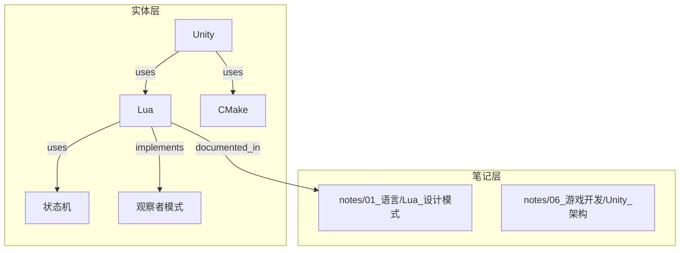

# Plan B: LLM Wiki 三层架构升级方案

> 侧重：实体概念使用结构化数据 + Bases 数据库视图

---

## 一、目标结构（三层架构）

```
wiki/
├── _index/                      # 索引层（不变）
│   ├── index.md / index_by_*.md
│   └── base/
│       ├── index_*.base        # 分类笔记索引
│       └── entities/           # 新增：实体索引视图
│           ├── entities_all.base
│           ├── entities_by_type.base
│           └── relationships.base
├── notes/                       # 详细笔记层（现有 00_xxx 改名）
│   ├── 00_日记/
│   ├── 01_语言/
│   ├── 02_编程工具/
│   ├── 03_项目/
│   ├── 04_领域/
│   ├── 05_综合/
│   ├── 06_游戏开发/
│   └── 07_misc/
└── entities/                    # 实体概念层（新增）
    ├── _index.md               # 实体总索引
    ├── concepts/               # 概念（抽象、可继承）
    ├── objects/                # 实体（具体、有实例）
    ├── relations/              # 关系定义
    │   ├── index.json         # 关系总表
    │   └── *.relation.md      # 单个关系详情
    └── .base/                 # 实体 Bases 视图
        ├── entities_by_type.base
        └── relations.base
```

**核心变化**：
- `wiki/00_xxx/` → `wiki/notes/00_xxx/`（笔记层）
- 新增 `wiki/entities/`（实体层）
- `entities/` 使用结构化数据 + JSON 关系存储

---

## 二、实体/概念 Frontmatter Schema

```yaml
---
title: 实体名称
type: entity | concept | relation
entity_type: person | project | tool | language | framework | concept | theory | pattern
tags: [tag1, tag2]
created: 2026-04-14
updated: 2026-04-14
description: 一句话描述（≤30字）

# 实体特有字段
aliases: [别名1, 别名2]        # 实体专有
wikipedia: URL                 # 实体专有

# 关系特有字段
source: [[entity-a]]           # 关系专有
target: [[entity-b]]           # 关系专有
relation_type: implements | extends | uses | depends_on | relates_to

# 跨层引用
related_notes: [[notes/xx/yy]] # 关联的笔记
---

# 实体/概念内容
```

**类型说明**：

| type | 说明 | 示例 |
|------|------|------|
| `entity` | 具体实体（有实例） | Lua语言、Unity引擎、CMake |
| `concept` | 抽象概念（可继承/组合） | 状态机、观察者模式、闭包 |
| `relation` | 关系定义（描述实体间联系） | Lua→实现→状态机 |

---

## 三、关系存储方案

### 3.1 JSON 总表 (entities/relations/index.json)

```json
{
  "version": "1.0",
  "last_updated": "2026-04-14",
  "relations": [
    {
      "id": "rel-001",
      "type": "uses",
      "source": "lua",
      "target": "状态机",
      "bidirectional": false,
      "description": "Lua 脚本使用状态机模式",
      "created": "2026-04-14",
      "source_note": "notes/01_语言/Lua_设计模式.md"
    }
  ]
}
```

### 3.2 单关系文件 (entities/relations/*.relation.md)

```markdown
---
title: Lua 使用状态机
type: relation
relation_type: uses
source: [[lua]]
target: [[状态机]]
bidirectional: false
created: 2026-04-14
description: Lua 脚本使用状态机模式进行组织
---

# Lua 使用状态机

## 关系详情

- **类型**: `uses`
- **来源**: [[lua]]
- **目标**: [[状态机]]
- **方向**: 单向（来源 → 目标）

## 说明

Lua 脚本通过 table + function 实现状态机模式...

## Mermaid 可视化


```

### 3.3 Mermaid 可视化（嵌入 Base 视图）



---

## 四、Bases 视图设计

### 4.1 实体总索引 (entities/.base/entities_by_type.base)

```yaml
---
name: entities_by_type
description: 实体按类型索引
---

filters:
  and:
    - file.inFolder("wiki/entities/")

properties:
  title:
    displayName: 实体名
  entity_type:
    displayName: 类型
  description:
    displayName: 描述
  updated:
    displayName: 更新

views:
  - type: table
    name: "全部实体"
    groupBy:
      property: entity_type
      direction: ASC
  - type: card
    name: "实体卡片视图"
```

### 4.2 关系索引 (entities/.base/relations.base)

```yaml
---
name: relations_index
description: 实体关系索引
---

filters:
  and:
    - file.inFolder("wiki/entities/relations/")

properties:
  title:
    displayName: 关系
  relation_type:
    displayName: 类型
  source:
    displayName: 来源
  target:
    displayName: 目标

views:
  - type: table
    name: "关系列表"
  - type: board
    name: "关系看板"
    groupBy: relation_type
```

---

## 五、需要修改的文件列表

### 5.1 配置文件

| 文件 | 操作 | 说明 |
|------|------|------|
| `CLAUDE.md` | 修改 | 更新目录结构、frontmatter 规范、实体层说明 |
| `.claude/system-prompt.md` | 可能修改 | 若 system prompt 包含 wiki 结构说明 |

### 5.2 Skill 文件

| 文件 | 操作 | 说明 |
|------|------|------|
| `.claude/skills/wiki-structure/SKILL.md` | 修改 | 添加 entities/ 目录规范、frontmatter schema |
| `.claude/skills/obsidian-bases/SKILL.md` | 参考 | 创建 entities Bases 视图时使用 |

### 5.3 Agent 文件

| 文件 | 操作 | 说明 |
|------|------|------|
| `.claude/agents/wiki-ingest-agent.md` | 修改 | 支持实体 ingest、更新 Memory/relationships |
| `.claude/agents/wiki-lint-agent.md` | 修改 | 检查实体完整性、关系一致性 |
| `.claude/agents/wiki-query-agent.md` | 修改 | 支持实体搜索、关系联想 |
| `.claude/agents/wiki-process-agent.md` | 修改 | 支持实体迁移/合并 |

### 5.4 Memory 文件

| 文件 | 操作 | 说明 |
|------|------|------|
| `Memory/MEMORY.md` | 修改 | 添加实体相关 Memory 入口 |
| `Memory/relationships/SUMMARY.md` | 修改 | 支持实体关系统计 |
| `Memory/relationships/pages/*.md` | 修改 | 支持实体关系追踪 |
| `Memory/stats/` | 扩展 | 添加 entities/ 目录状态追踪 |

### 5.5 Wiki 自身文件

| 文件 | 操作 | 说明 |
|------|------|------|
| `wiki/index.md` | 修改 | 添加三层架构说明 |
| `wiki/_index/index_by_category.md` | 修改 | 添加实体分类 |
| `wiki/00_xxx/` | 重命名 | → `wiki/notes/00_xxx/` |
| `wiki/entities/` | 新建 | 实体概念层 |
| `wiki/entities/relations/index.json` | 新建 | 关系总表 |
| `wiki/_index/base/entities/` | 新建 | 实体 Bases 视图 |

---

## 六、迁移策略

### 阶段一：创建基础设施（不破坏现有结构）

1. 创建 `wiki/entities/` 目录结构
2. 创建 `entities/.base/` Bases 视图
3. 创建 `entities/relations/index.json`
4. 更新 `CLAUDE.md` 添加实体层说明
5. 更新 `wiki-structure` skill

**风险**：低，仅新增文件

### 阶段二：迁移现有笔记到 notes/

1. 重命名 `wiki/00_xxx/` → `wiki/notes/00_xxx/`
2. 更新所有 `[[wikilink]]` 引用路径
3. 更新 `_index/base/*.base` 筛选路径
4. 更新 `Memory/stats/` 中的路径引用

**风险**：中，需批量更新 wikilinks

### 阶段三：实体提取（可选、增量进行）

1. 从现有笔记中识别实体/概念
2. 创建 `entities/concepts/*.md` 和 `entities/objects/*.md`
3. 建立关系记录到 `relations/index.json`
4. 在原笔记中添加 `related_entities` 字段

**风险**：低，可按需进行

### 阶段四：更新 Agent 工作流

1. 更新 `wiki-ingest-agent` 支持实体识别
2. 更新 `wiki-query-agent` 支持关系联想
3. 更新 `Memory/relationships/` 支持实体关系

---

## 七、关键设计决策

### 7.1 为什么用 JSON 存储关系？

- **可被 Agent 解析**：JSON 可直接被 LLM 读取和推理
- **支持批量查询**：一次读取获取所有关系
- **Mermaid 转换**：JSON → Mermaid 自动生成可视化
- **与 .base 共存**：.base 提供 Obsidian 内可视化，JSON 提供 AI 推理

### 7.2 实体层与笔记层分离的好处？

- **搜索效率**：Agent 可快速定位实体再找关联笔记
- **联想能力**：实体关系可独立扩展，形成知识图谱
- **关注点分离**：笔记记录详情，实体记录概念

### 7.3 为什么不把所有笔记转成实体？

- **笔记是详细记录**：包含过程、思考、代码示例
- **实体是抽象概念**：可跨笔记复用、形成网络
- **共存互补**：笔记引用实体，实体链接笔记

---

## Critical Files for Implementation

- d:/AI Project/AINote/CLAUDE.md
- d:/AI Project/AINote/.claude/skills/wiki-structure/SKILL.md
- d:/AI Project/AINote/.claude/agents/wiki-ingest-agent.md
- d:/AI Project/AINote/Memory/relationships/SUMMARY.md
- d:/AI Project/AINote/wiki/_index/base/index_01_语言_notes.base
