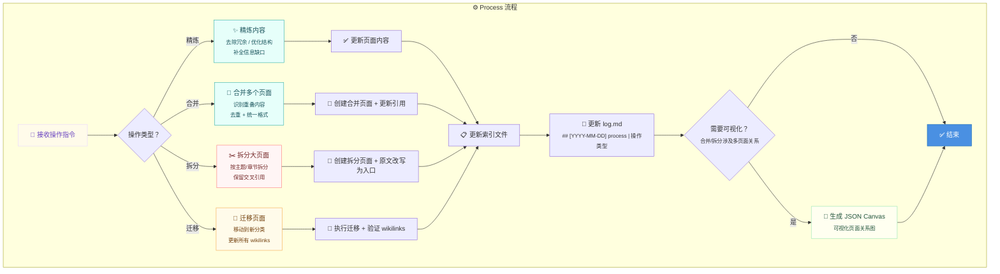
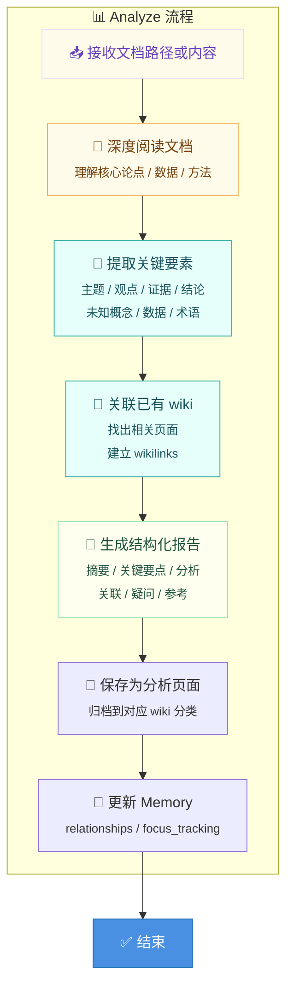

```mermaid
flowchart TD
    subgraph INGEST["🔄 Ingest 流程"]
        A["📥 检查 raw/_input/files/"] --> B{"文件存在？"}
        B -->|"无文件"| Z["✅ 结束：无需处理"]
        B -->|"有文件"| C["📂 分析文件类型<br/><sub>article / paper / book<br/>video / podcast / diary</sub>"]

        C --> D["🔍 判断 wiki 分类<br/><sub>00_日记 / 01_语言 / 02_编程工具<br/>03_项目 / 04_领域 / 05_综合 / 06_游戏开发</sub>"]

        D --> E["📄 读取源文件内容<br/><sub>理解主题、结构、关键信息</sub>"]

        E --> F["✨ 创建 wiki 页面<br/><sub>frontmatter + Obsidian 格式<br/>wikilinks / callouts / embeds</sub>"]

        F --> G["🏷️ 生成 frontmatter 元数据<br/><sub>title / created / updated<br/>description / tags / aliases</sub>"]

        G --> H["🚚 移动文件到归档目录<br/><sub>raw/{category}/</sub>"]

        H --> I["📋 更新索引文件<br/><sub>index.md / index_by_category.md<br/>index_by_time.md / index_XX_xxx.md</sub>"]

        I --> J["📝 追加 log.md<br/><sub>## [YYYY-MM-DD] ingest | Title</sub>"]

        J --> K["📊 生成 ingest 报告<br/><sub>raw/_input/reports/{时间}report-{slug}.md</sub>"]

        K --> L["🧠 更新 Memory<br/><sub>raw_stats.md / relationships/<br/>stats/ / focus_tracking.md</sub>"]
    end

    L --> Z

    style Z fill:#4A90E2,color:#fff,stroke:#2171B5
    style A fill:#FFFBEA,stroke:#E9D8FD,color:#6B46C1
    style E fill:#FFFBEA,stroke:#F6AD55,color:#744210
    style F fill:#E6FFFA,stroke:#38B2AC,color:#1A535C
    style G fill:#E6FFFA,stroke:#38B2AC,color:#1A535C
    style K fill:#FFF5F5,stroke:#FC8181,color:#742A2A
    style L fill:#FFFFF0,stroke:#9AE6B4,color:#22543D
```

# Wiki 工作流文档

本文档详细描述 LLM Wiki 五个核心操作的执行流程，每个操作均配有 Mermaid 流程图（推荐流程）和 JSON Canvas 大图（复杂操作）。

---

## 概览：五个核心操作

| 操作 | 触发词 | 输入 | 输出 |
|------|--------|------|------|
| [[wiki-ingest]] | "处理这个源" / "ingest" | `raw/_input/files/` 中的新文件 | wiki 页面 + 索引更新 + ingest 报告 |
| [[wiki-query]] | "关于 xxx" / "query" | 用户问题 | 综合答案 + 归档优质答案到 wiki |
| [[wiki-lint]] | "整理 wiki" / "lint" | wiki/ 目录 | 健康报告 + 矛盾/过时/孤立页面标记 |
| [[wiki-process]] | "整理一下" / "精炼" | wiki 已有页面 | 精炼/合并/拆分/迁移后的新内容 |
| [[wiki-analyze]] | "分析这个" / "文档分析" | 源文档或 wiki 页面 | 深度分析报告 |

---

## 1. wiki-ingest

**触发词**：`"处理这个源"` / `"ingest"` / `"加入 wiki"`
**输入**：`raw/_input/files/` 中的未分类源文件
**输出**：wiki 页面、索引更新、ingest 报告、Memory 更新

### 流程图（Mermaid）



### JSON Canvas 大图

> [!canvas]- Ingest 完整流程图
> ![[wiki_workflow-ingest.canvas]]

### 详细步骤

1. **检查入口**：`raw/_input/files/` — 只检查此处，不检查 raw/ 子目录
2. **类型判断**：根据文件扩展名和内容判断类型（article/paper/book/video/podcast/diary）
3. **分类判断**：根据内容主题映射到 00_xxx 分类
4. **内容理解**：提取标题、核心概念、关键引用、结构大纲
5. **页面创建**：生成 Obsidian 格式页面，含 frontmatter、wikilinks、callouts
6. **元数据**：created/updated 自动填充，description ≤30 字
7. **文件归档**：移动到 `raw/{category}/`
8. **索引更新**：更新三级索引（主索引 + 分类索引 + Bases 视图自动更新）
9. **日志追加**：append-only 到 `wiki/log.md`
10. **报告生成**：存到 `raw/_input/reports/`
11. **Memory 更新**：stats / relationships / focus_tracking

---

## 2. wiki-query

**触发词**：`"关于 xxx"` / `"query"` / `"wiki 中有没有提到"`
**输入**：用户自然语言问题
**输出**：综合答案 + 归档优质答案到 wiki（如有必要）

### 流程图（Mermaid）

```mermaid
flowchart TD
    subgraph QUERY["🔍 Query 流程"]
        A["❓ 接收用户问题"] --> B["🧠 理解问题意图<br/><sub>用户想知道什么？什么类型？</sub>"]

        B --> C["📂 确定搜索范围<br/><sub>全部 wiki / 指定分类 / 指定页面</sub>"]

        C --> D["🔎 搜索 wiki 内容<br/><sub>全文检索 + wikilink 图遍历<br/>+ frontmatter 属性查询</sub>"]

        D --> E["📋 收集相关页面<br/><sub>按相关性排序</sub>"]

        E --> F{"有直接答案？"}
        F -->|"有足够信息"| G["🧩 综合多页面内容<br/><sub>提取要点、关联引用<br/>形成完整答案</sub>"]
        F -->|"信息不足"| H["⚠️ 标记信息缺口<br/><sub>提示用户哪些方面缺乏资料</sub>"]

        G --> I{"答案有价值？<br/><sub>是否有独立保存价值？</sub>"]
        H --> I

        I -->|"是"| J["💾 归档优质答案到 wiki<br/><sub>新建 Q&A 页面或补充现有页面</sub>"]
        I -->|"否"| K["✅ 直接输出答案<br/><sub>不归档</sub>"]
        J --> L["📝 更新 log.md"]
        K --> L
    end

    L --> M["✅ 结束"]
    H --> M

    style M fill:#4A90E2,color:#fff,stroke:#2171B5
    style A fill:#FFFBEA,stroke:#E9D8FD,color:#6B46C1
    style G fill:#E6FFFA,stroke:#38B2AC,color:#1A535C
    style I fill:#FFF5F5,stroke:#FC8181,color:#742A2A
    style J fill:#FFFFF0,stroke:#9AE6B4,color:#22543D
    style K fill:#FFFFF0,stroke:#9AE6B4,color:#22543D
```

### JSON Canvas 大图

> [!canvas]- Query 完整流程图
> ![[wiki_workflow-query.canvas]]

### 详细步骤

1. **理解问题**：识别问题类型（定义/教程/对比/参考/综述）
2. **确定范围**：根据问题关键词决定搜索范围
3. **搜索策略**：全文搜索 + wikilink 关系图遍历 + frontmatter 属性过滤
4. **综合答案**：从多个页面提取相关段落，关联引用，综合成完整答案
5. **信息缺口**：如信息不足，诚实告知用户
6. **归档决策**：有价值且完整的答案归档到 wiki（如新建 Q&A 页面）
7. **日志**：追加 `## [YYYY-MM-DD] query | Question` 到 log.md

---

## 3. wiki-lint

**触发词**：`"整理 wiki"` / `"lint"` / `"健康检查"` / `"维护"`
**输入**：wiki/ 目录全部内容
**输出**：健康报告 + 矛盾/过时/孤立页面标记

### 流程图（Mermaid）

```mermaid
flowchart TD
    subgraph LINT["🔧 Lint 流程"]
        A["🚀 启动 wiki-lint-agent"] --> B["📊 扫描 wiki 结构<br/><sub>目录完整性 / 索引一致性</sub>"]

        B --> C{"发现结构问题？"}
        C -->|"是"| C1["🔧 修复结构问题<br/><sub>缺失索引 / 孤立页面</sub>"]
        C1 --> D
        C -->|"否"| D["📄 检查每个 wiki 页面"]

        D --> E{"存在矛盾？<br/><sub>同一主题多个页面说法不一</sub>"}
        E -->|"是"| E1["⚠️ 标记矛盾页面<br/><sub>记录到矛盾列表</sub>"]
        E1 --> F
        E -->|"否"| F{"页面过时？<br/><sub>内容与最新源文档不符</sub>"]

        F -->|"是"| F1["📅 标记过时页面<br/><sub>更新 updated 字段</sub>"]
        F1 --> G
        F -->|"否"| G{"孤立页面？<br/><sub>无反向链接 / 未被任何页面引用</sub>"]

        G -->|"是"| G1["🔗 标记孤立页面<br/><sub>加入孤立列表</sub>"]
        G1 --> H
        G -->|"否"| H["📋 汇总健康报告"]

        H --> I["📝 生成健康报告<br/><sub>矛盾列表 / 过时列表 / 孤立列表</sub>"]

        I --> J["🧠 更新 Memory/reports.md"]
    end

    J --> K["✅ 结束"]
    E2["✅ 无矛盾"] --> H
    F2["✅ 无过时"] --> G
    G2["✅ 无孤立"] --> H

    style K fill:#4A90E2,color:#fff,stroke:#2171B5
    style A fill:#FFFBEA,stroke:#E9D8FD,color:#6B46C1
    style E1 fill:#FFF5F5,stroke:#FC8181,color:#742A2A
    style F1 fill:#FFFBEA,stroke:#F6AD55,color:#744210
    style G1 fill:#E6FFFA,stroke:#38B2AC,color:#1A535C
    style I fill:#FFFFF0,stroke:#9AE6B4,color:#22543D
```

### 详细步骤

1. **扫描结构**：检查 wiki/ 目录完整性、索引文件一致性
2. **矛盾检测**：对比同一主题的不同页面，标记说法不一的内容
3. **过时检测**：对比 wiki 页面与对应源文档（raw/），标记未更新的内容
4. **孤立检测**：检查哪些页面未被 wikilinks 引用
5. **生成报告**：汇总三类问题，写入 `Memory/reports.md`
6. **主动修复**：可顺便修复简单问题（缺失索引、空引用等）

---

## 4. wiki-process

**触发词**：`"整理一下"` / `"精炼"` / `"合并"` / `"拆分"` / `"迁移"`
**输入**：wiki 已有页面
**输出**：精炼/合并/拆分/迁移后的新内容

### 流程图（Mermaid）



### 详细步骤

1. **识别操作**：判断是精炼 / 合并 / 拆分 / 迁移
2. **执行操作**：
   - 精炼：去除重复措辞、优化结构、补全信息
   - 合并：识别重叠内容、去重、建立交叉引用
   - 拆分：按逻辑章节拆分，原文改为入口页
   - 迁移：移动文件、更新所有 wikilinks、更新索引
3. **更新索引**：更新相关索引文件（index_by_category.md / index_XX_xxx.md）
4. **日志**：追加到 log.md
5. **Canvas 可视化**：合并/拆分时生成 JSON Canvas 展示页面关系

---

## 5. wiki-analyze

**触发词**：`"分析这个"` / `"文档分析"` / `"生成报告"` / `"帮我理解这篇"`
**输入**：源文档（raw/）或 wiki 页面
**输出**：深度分析报告 + 结构化总结

### 流程图（Mermaid）



### 详细步骤

1. **接收输入**：可以是源文档路径、URL、或粘贴的内容
2. **深度阅读**：提取核心论点、关键数据、研究方法、结论
3. **结构化提取**：生成结构化报告（摘要 + 关键要点 + 分析 + 关联 + 疑问 + 参考）
4. **建立关联**：关联已有 wiki 页面，添加 wikilinks
5. **归档**：保存到对应 wiki 分类
6. **Memory 更新**：更新 relationships 和 focus_tracking

---

## 附录：Agent 调用规则

> [!important] Agent 调用规范
> 执行任何 Wiki 操作时，必须调用对应的 Agent：
> - Ingest → `wiki-ingest-agent`
> - Query → `wiki-query-agent`
> - Lint → `wiki-lint-agent`
> - Process → `wiki-process-agent`
> - Analyze → `wiki-analyze-agent`
>
> **文件创建规范**：
> - Markdown 文件 → 使用 `obsidian-markdown` skill
> - `.base` 数据库视图 → 使用 `obsidian-bases` skill
> - 页面关系可视化 → 使用 `json-canvas` skill

---

## 相关文件

| 文件 | 说明 |
|------|------|
| [[wiki_workflow-ingest.canvas]] | Ingest 操作完整流程图（JSON Canvas） |
| [[wiki_workflow-query.canvas]] | Query 操作完整流程图（JSON Canvas） |
| [[LLM_Wiki_Workflows]] | 工作流原始参考 |
| [[CLAUDE]] | 项目配置与目录结构 |
