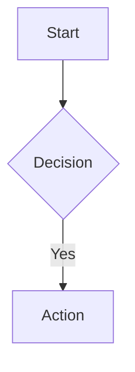

# Obsidian Flavored Markdown Skill

Create and edit valid Obsidian Flavored Markdown. Obsidian combines CommonMark, GitHub Flavored Markdown, LaTeX math, and its own extensions (wikilinks, callouts, embeds, block references, etc.).

This skill covers **all** built-in Markdown syntax plus every Obsidian-specific extension. When writing Obsidian notes, follow these conventions to ensure correct rendering in both Editing/Live Preview and Reading view.

---

## Example Files

Detailed examples are in the `examples/` directory. **Do NOT read all example files upfront** — only load the specific file when you need that syntax category. The Quick Reference below covers most common cases; examples are for edge cases and detailed patterns.

| Category | File |
|---|---|
| Basic Formatting | [text-and-headings.md](examples/text-and-headings.md) |
| Links & Embeds | [links-and-embeds.md](examples/links-and-embeds.md) |
| Callouts | [callouts.md](examples/callouts.md) |
| Tables & Lists | [tables-and-lists.md](examples/tables-and-lists.md) |
| Code & Math | [code-and-math.md](examples/code-and-math.md) |
| Diagrams | [mermaid-diagrams.md](examples/mermaid-diagrams.md) |
| Properties & Tags | [properties-and-tags.md](examples/properties-and-tags.md) |
| Advanced | [footnotes-comments-html.md](examples/footnotes-comments-html.md) |

---

## Quick Reference

For comprehensive examples with detailed usage patterns, see the `examples/` directory (table above). This section provides quick syntax reference for common operations.

### Basic Formatting

```markdown
# Heading 1  ## Heading 2  ### Heading 3
**bold**  *italic*  ***bold+italic***  ~~strikethrough~~  ==highlight==  `inline code`
```

Highlight (`==text==`) is Obsidian-specific. Escape special chars with `\`: `\*`, `\_`, `\#`

### Links (Wikilinks - Obsidian default)

```markdown
[[Note]]                        # Basic link
[[Note|Display]]                # Custom display text
[[Note#Heading]]                # Link to heading
[[Note#^block-id]]              # Link to block
[[##heading]]                   # Search headings vault-wide
```

**Block references:** Add `^id` at end of any block:
```markdown
This paragraph can be referenced. ^my-block-id
```

**Markdown links** (spaces as `%20`): `[Text](Note%20Name.md#Heading)`

### Embeds

All embeds use `!` prefix: `![[target]]`

```markdown
![[Note]]                       # Embed entire note
![[Note#Section]]               # Embed heading section
![[image.png|640]]              # Image with width (maintains aspect ratio)
![[audio.mp3]]                  # Audio: .flac, .m4a, .mp3, .ogg, .wav, .webm
![[video.mp4]]                  # Video: .mp4, .webm, .ogv
![[doc.pdf#page=3]]             # PDF at page 3
```

External images: `` (pipe sizing is Obsidian-only)

### Callouts

```markdown
> [!note] Default style
> [!tip]+ Expanded by default (click to collapse)
> [!warning]- Collapsed by default (click to expand)
> > [!example] Nested callout (use additional >)
```

**12 built-in types:** `note`, `abstract`/`summary`/`tldr`, `info`/`todo`, `tip`/`hint`/`important`, `success`/`check`/`done`, `question`/`help`/`faq`, `warning`/`caution`/`attention`, `failure`/`fail`/`missing`, `danger`/`error`, `bug`, `example`, `quote`/`cite`

**Custom callouts** (CSS snippet in `.obsidian/snippets/`):
```css
.callout[data-callout="custom-type"] {
    --callout-color: 255, 100, 50;
    --callout-icon: lucide-sparkles;
}
```

**GitHub compatibility:** Only 5 types work on GitHub: `NOTE`, `TIP`, `IMPORTANT`, `WARNING`, `CAUTION`. Folding, nesting, and other 7 types are Obsidian-only.

### Lists & Tables

```markdown
- Unordered  * also works  + also works
1. Ordered
   1. Nested (3 spaces indent)
- [ ] Incomplete task  - [x] Completed task

| Left | Center | Right |
|:-----|:------:|------:|
| data | data   | data  |
```

### Code & Math

````markdown
`inline code`  ``code with ` backtick``

```language
code block
```

Inline math: $x^2$, $\frac{a}{b}$, $\sqrt{x}$
Block math:
$$
\int_a^b f(x)dx
$$
````

### Diagrams (Mermaid)

````markdown

````

Supported: flowchart, sequence, gantt, pie, class, state, erDiagram. Nodes can use `internal-link` class for clickable links.

### Properties (Frontmatter)

```yaml
---
title: My Note
tags: [project, active]
aliases: [Alternative Name]
related: "[[Other Note]]"  # Must be quoted!
---
```

**Property types:** Text, Number, Checkbox, Date, Date & Time, List, Links

**Important rules:**
- Property name must have **same type** across entire vault
- Internal links **must be quoted**: `link: "[[Note]]"`
- Use plural forms: `tags`, `aliases`, `cssclasses` (singulars deprecated)

### Tags

```markdown
#tag  #nested/tag  #tag-with-dashes
```

- Must contain at least one non-numeric character (`#1984` invalid, `#y1984` valid)
- Case-insensitive, no spaces
- Allowed: letters, numbers, `_`, `-`, `/`
- NOT allowed: `.`, `&`, `@`, `$`, `%`, brackets

### Footnotes & Comments

```markdown
Text with footnote[^1].
[^1]: Footnote content.

Inline footnote^[Content here.]  # Reading view only

%%Obsidian comment%%  # Hidden in Reading view
<!-- HTML comment -->  # Portable
```

### HTML

Obsidian supports inline HTML: `<div>`, `<span style="color: red;">`, `<details>`, `<kbd>Ctrl</kbd>`, `<br>`, `<mark>`

---

## Important Behavior Notes

### Wikilinks vs Markdown Links

Wikilinks `[[Note]]` are Obsidian's default - they auto-update on rename and support block references. Markdown links `[Text](file.md)` are portable but don't auto-update. Configure in Settings > Files & Links.

### Block References & Embeds

Blocks can be **referenced** (linked to) or **embedded** (content live-included). Block IDs can be placed after paragraphs, lists, tables, or blockquotes. Embedding a heading section includes everything until the next same-level heading.

### Callout Folding & Nesting

`+` after type = expanded by default, `-` = collapsed by default. Callouts can nest arbitrarily deep using additional `>` markers.

### Properties Constraints

A property name must have the **same type** across the entire vault. Internal links in properties **must be quoted** to prevent YAML parsing errors. Use plural forms (`tags`, `aliases`, `cssclasses`) as singulars are deprecated.

### Portability Considerations

**Obsidian-only** (won't render outside Obsidian): wikilinks, embeds, block references, `==highlight==`, `%%comments%%`, image pipe sizing, 7 extra callout types, callout folding/nesting

**GitHub-compatible:** Standard Markdown, MathJax, Mermaid, footnotes, 5 callout types (NOTE, TIP, IMPORTANT, WARNING, CAUTION), tables, task lists, strikethrough

---

## Invalid Characters

Cannot be used in filenames or link targets: `# | ^ : %% [[ ]]`
